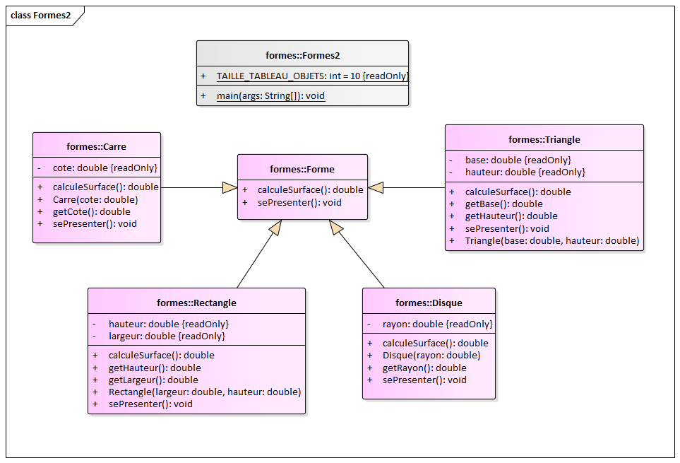

# Exercice 09 : Formes2
## Durée : 60'
## Objectifs visés :
Cet exercice pour les avancés permet de se faire une première idée de ce qu’est l’héritage en Java. En particulier ce qu’il peut apporter en termes de simplifications au niveau du code à écrire.

## Travail à réaliser
Vous allez devoir apporter quelques petites adaptations ici et là à votre projet pour qu’il tire profit de l’héritage. La conséquence directe est que le code dans la boucle de votre main() va fondre et grandement se simplifier :

``` java
package formes;
public class Formes2 {
    public final static int TAILLE_TABLEAU_OBJETS = 10;
    public static void main( String[] args ) {
        // Création de nos diverses formes
        Triangle t1 = new Triangle( 4, 3 );
        Triangle t2 = new Triangle( 2, 2 );
        Carre c1 = new Carre( 5 );
        Carre c2 = new Carre( 3 );
        Rectangle r1 = new Rectangle( 4, 3 );
        Rectangle r2 = new Rectangle( 2, 2 );
        Disque d1 = new Disque( 5 );
        Disque d2 = new Disque( 3 );

        // On les mets dans un tableau d'objets (rappel : en Java tout objet créé est également un Object)
        Forme[] mesFormes = new Forme[ TAILLE_TABLEAU_OBJETS ];
        mesFormes[0] = t1;
        mesFormes[1] = c1;
        mesFormes[2] = r2;
        mesFormes[3] = d2;
        mesFormes[4] = d1;
        mesFormes[5] = t2;
        mesFormes[8] = c2;
        mesFormes[9] = r2;

        // Cool, on ne peut plus y mettre de String puisque ce n'est pas une "Forme"
        //mesFormes[6] = "Coucou je suis une chaîne de caractères";

        // On se promène dans le tableau et, selon avec qui on a à faire, on affiche qui c'est et sa surface
        for ( int i = 0; i < mesFormes.length; i++ ) {
            // Mettre la main sur l'objet à cet endroit-là
            Forme maForme = mesFormes[i];
            // Y en a-t-il un ?
            if ( maForme != null ) {
                // Pas besoin de connaître "à qui avons-nous à faire" vu qu'au minimum c'est une forme
                maForme.sePresenter();
                System.out.println( "Ma surface est de " + maForme.calculeSurface() + "[m^2]" );
                System.out.println( "-----------------------" );
            }
        }
    }
```

Pour que le code du `main()` qui vous est cette fois-ci donné puisse fonctionner, on va procéder à quelques modifications. Pour commencer, on va créer une classe Forme. Son code étant affreusement compliqué (tout comme l’héritage Java d’ailleurs), il vous est donné ci-dessous :

``` java
package formes;

public class Forme {

    public void sePresenter() {
        System.out.println( "Je suis une forme abstraite, pas définie" );
    }

    public double calculeSurface() {
        return 0;
    }
}
```
Fastoche non ? Bon, ensuite on va dire à Java que nos classes `Carre`, `Rectangle`, `Disque` et `Triangle` héritent de cette classe `Forme`. Une façon « Java » de dire que c’est elles-aussi des « Forme(s) » quoi… Mais cette fois-ci à vous de découvrir les changements à apporter dans vos classes `Carre`, `Rectangle`, `Disque` et `Triangle`. Servez-vous d’internet pour trouver comment on dit en Java que ces classent « héritent » de Forme.

Si vous faites les modifications nécessaires correctement, le résultat sur la console restera le même !

**Conclusions** : l’héritage simplifie le code Java et bien souvent le diminue grandement. Sympa non ? Mais bon, on va quand même en garder un peu pour les prochains modules.

### Diagramme de classes
Observez ce nouveau type de flèches pour indiquer en UML qu’il y a de l’héritage !

